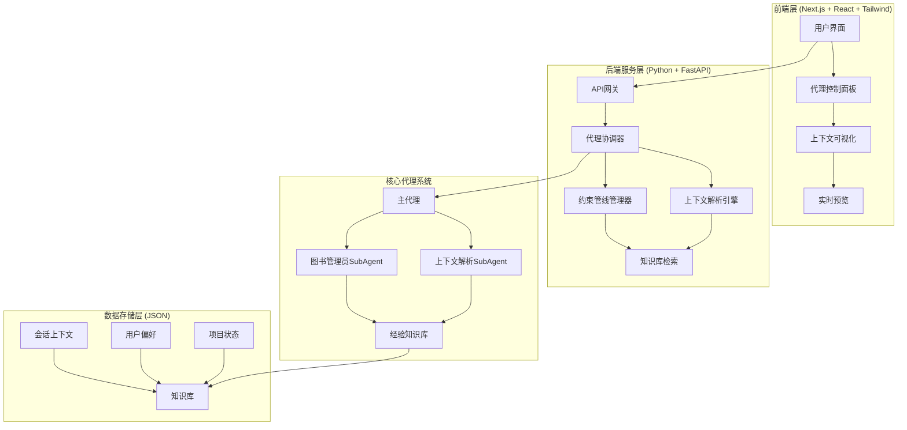

# Vibe Engineering 平台 - 概念性架构设计文档

## 📋 项目概述

### 核心理念
Vibe Engineering 是一个新一代的代理式工程平台，融合"Vibe Coding"的直觉感知与"Engineering"的系统稳定性，通过代理框架系统包装LLM能力，为用户提供全合一的创作体验。

### 关键特性
- **语义上下文管理系统**：解决AI生成内容与人类工作语境脱节的问题
- **约束管线**：通过知识库实现持续学习和经验积累
- **模块化架构**：技术栈透明解耦，便于定制修改

---

## 🏗️ 系统架构概览



---

## 🧩 模块化设计

### 1. 前端架构 (Next.js + React + Tailwind CSS)

<details>
<summary>展开详细前端设计</summary>

#### 页面结构
```
/pages
├── index.tsx              # 主工作区
├── context-viewer.tsx     # 上下文可视化
├── agent-control.tsx      # 代理控制面板
└── settings.tsx           # 系统设置
```

#### 核心组件
- **VibeWorkspace**：主工作容器，支持多标签和分屏
- **ContextParser**：解析和展示上下文报告
- **ConstraintPipeline**：可视化约束管线状态
- **PreviewCanvas**：实时预览生成结果

#### 状态管理
```typescript
// 建议使用Zustand进行轻量状态管理
interface AppState {
  sessions: Session[];
  activeSession: string;
  contextHistory: ContextEntry[];
  constraintState: ConstraintPipelineState;
}
```
</details>

### 2. 后端架构 (Python + FastAPI)

<details>
<summary>展开详细后端设计</summary>

#### API端点设计
```python
# 核心API路由
app = FastAPI(title="Vibe Engineering API")

# 代理相关
@app.post("/api/v1/agents/create")
@app.post("/api/v1/agents/{agent_id}/execute")

# 上下文管理
@app.get("/api/v1/context/{session_id}/parse")
@app.post("/api/v1/context/{session_id}/update")

# 知识库操作
@app.get("/api/v1/knowledge/search")
@app.post("/api/v1/knowledge/store")
```

#### 核心服务类
```python
class AgentOrchestrator:
    """代理协调器 - 管理主代理和SubAgents"""
    
class ContextParserEngine:
    """上下文解析引擎 - 实现上下文解析SubAgent"""
    
class ConstraintPipelineManager:
    """约束管线管理器 - 管理知识库和经验积累"""
```
</details>

---

## 🔄 核心工作流程

### 1. 会话生命周期
```
用户输入 → 约束管线检查 → 主代理处理 → SubAgent辅助 → 结果生成 → 知识库更新
```

### 2. 上下文解析流程
```python
def parse_context_workflow(user_instruction: str, context: dict):
    """
    示例：.list changes --detailed[~4 sentences each]
    工作流程：
    1. 指令解析（提取操作类型和参数）
    2. 上下文选择（确定解析范围）
    3. SubAgent调用（专门解析代理）
    4. 报告生成（结构化总结）
    5. 格式化输出（用户友好展示）
    """
```

### 3. 约束管线工作机制
```yaml
约束管线:
  - 阶段1: 输入分析
    - 意图识别
    - 需求提取
  
  - 阶段2: 知识检索
    - 图书管理员SubAgent查询知识库
    - 相关经验匹配
  
  - 阶段3: 约束应用
    - 上下文适配
    - 最佳实践注入
  
  - 阶段4: 输出优化
    - 质量检查
    - 一致性验证
```

---

## 📊 数据架构 (JSON存储)

<details>
<summary>展开详细数据模型</summary>

### 会话数据结构
```json
{
  "session_id": "uuid4",
  "created_at": "ISO8601",
  "context_history": [
    {
      "timestamp": "ISO8601",
      "role": "user|assistant|system",
      "content": "string",
      "metadata": {
        "tokens_used": 0,
        "context_window": "string",
        "attachments": []
      }
    }
  ],
  "constraint_pipeline": {
    "active_rules": [],
    "knowledge_applied": [],
    "experience_score": 0.0
  }
}
```

### 知识库结构
```json
{
  "knowledge_base": {
    "user_preferences": {
      "coding_style": "string",
      "output_format": "string",
      "quality_thresholds": {}
    },
    "project_patterns": {
      "successful_workflows": [],
      "common_issues": [],
      "optimization_tips": []
    },
    "contextual_rules": {
      "frontend": [],
      "backend": [],
      "data_modeling": []
    }
  }
}
```

### SubAgent注册表
```json
{
  "subagents": {
    "context_parser": {
      "capabilities": ["parse_changes", "summarize", "extract_patterns"],
      "specialization": "context_analysis",
      "model_config": {}
    },
    "librarian": {
      "capabilities": ["search", "categorize", "retrieve"],
      "specialization": "knowledge_management",
      "model_config": {}
    }
  }
}
```
</details>

---

## 🎯 实现阶段规划

### Phase 1: 基础原型 (2-3周)
1. **基础框架搭建**
   - Next.js前端骨架
   - FastAPI后端基础
   - 简单JSON数据存储

2. **核心代理系统**
   - 主代理基础循环
   - 简单的上下文传递机制
   - 基础UI集成

### Phase 2: 上下文管理 (3-4周)
1. **上下文解析SubAgent**
   - 指令解析系统
   - 变更检测算法
   - 报告生成模板

2. **基础可视化**
   - 上下文历史时间线
   - 变更差异对比
   - Token使用统计

### Phase 3: 知识库系统 (4-5周)
1. **约束管线实现**
   - 知识存储和检索
   - 规则应用引擎
   - 经验积累机制

2. **图书管理员SubAgent**
   - 智能检索算法
   - 相关性评分
   - 知识分类系统

### Phase 4: 优化与扩展 (持续)
1. **性能优化**
   - 上下文压缩
   - 知识库索引
   - 缓存策略

2. **功能扩展**
   - 多模态集成
   - 团队协作
   - 云同步

---

## 🛠️ 开发指导原则

### 1. 模块化设计原则
```python
# 示例：如何保持接口解耦
class ContextParserInterface(ABC):
    """上下文解析器接口 - 具体实现可自由替换"""
    
    @abstractmethod
    def parse(self, context: dict, instruction: str) -> dict:
        pass
    
    @abstractmethod
    def summarize(self, parsed_data: dict) -> str:
        pass
```

### 2. 数据透明性
- 所有代理操作应记录完整决策链
- 提供原始数据和处理后的数据对照
- 支持上下文回溯和调试

### 3. 可扩展性设计
```yaml
插件系统架构:
  - Agent插件: 支持自定义代理类型
  - 解析器插件: 可扩展的上下文解析能力
  - 知识源插件: 支持多种知识存储后端
  - UI组件插件: 可定制的界面元素
```

### 4. 错误处理与恢复
```python
# 建议的错误处理模式
class VibeEngineeringError(Exception):
    """平台基础异常类"""
    
class ContextParsingError(VibeEngineeringError):
    """上下文解析专用异常"""
    
class ConstraintViolationError(VibeEngineeringError):
    """约束违反异常"""
```

---

## 🔮 未来展望

### 短期目标 (3-6个月)
- 建立稳定的上下文管理系统
- 实现基础的知识积累功能
- 支持常见的编程和文档生成场景

### 中期目标 (6-12个月)
- 多模态集成（视觉预览、设计稿分析）
- 团队协作功能
- 云端同步和版本管理

### 长期愿景 (1-2年)
- 自主学习和优化的代理系统
- 行业特定的专业知识库
- 企业级部署和集成方案

---

## 📝 附录

### A. 术语表
- **Vibe Engineering**: 结合直觉感知与系统工程的代理式创作平台
- **约束管线**: 通过知识库实现代理行为约束和优化的机制
- **SubAgent**: 专注于特定任务的辅助代理
- **上下文窗口**: 代理当前处理的信息范围

### B. 技术选型理由
1. **Next.js + React**: 服务端渲染支持，SEO友好，组件化开发
2. **Tailwind CSS**: 实用优先的CSS框架，快速UI开发
3. **FastAPI**: 高性能Python Web框架，自动API文档生成
4. **JSON存储**: 原型阶段快速迭代，无需复杂数据库配置

### C. 参考架构模式
- **代理协调器模式**: 管理多个代理实例的协作
- **管道过滤器模式**: 用于约束管线的数据处理
- **仓储模式**: 抽象数据访问层，便于未来数据库迁移

---

这个概念性设计文档为Vibe Engineering平台提供了全面的架构蓝图。建议从Phase 1开始，逐步实现各个模块，在原型阶段重点关注用户体验和核心功能的可行性验证。

**下一步行动建议**：
1. 搭建基础项目结构（前端+后端）
2. 实现最简单的代理对话循环
3. 设计基础的上下文数据结构
4. 开发第一个SubAgent原型（建议从上下文解析开始）

平台的成功关键在于平衡"Vibe"的直觉性与"Engineering"的系统性，这个设计文档提供了实现这一平衡的基础框架。