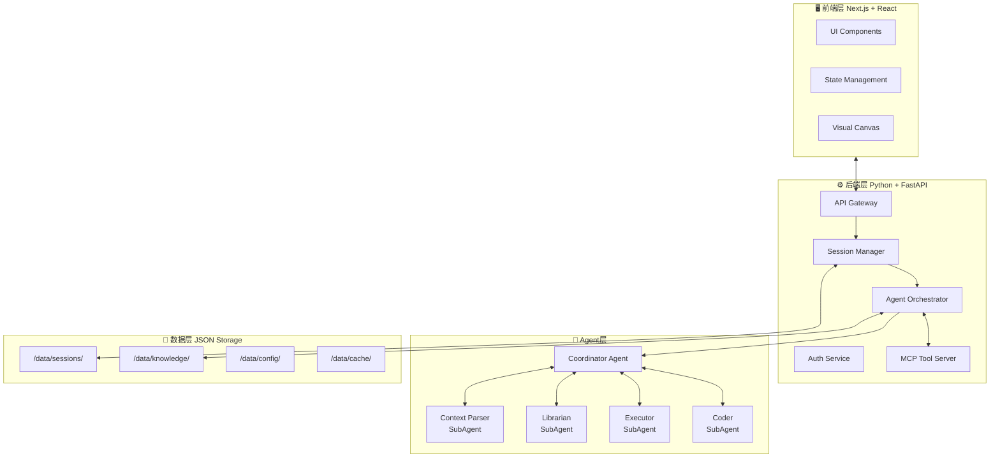
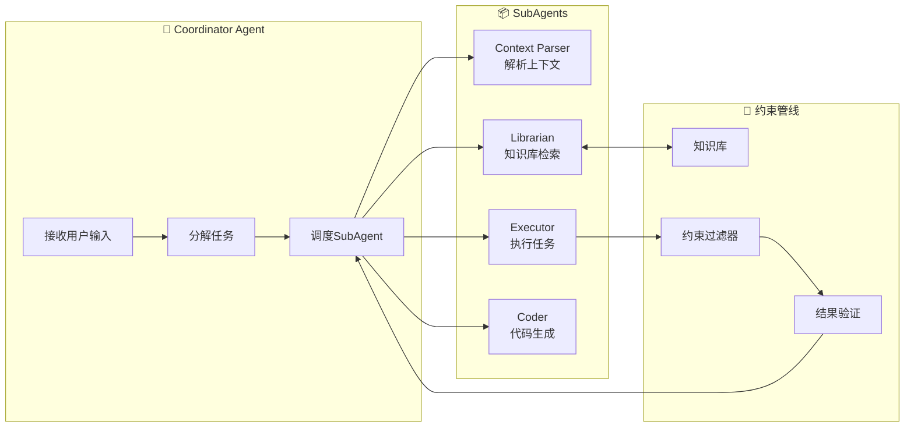
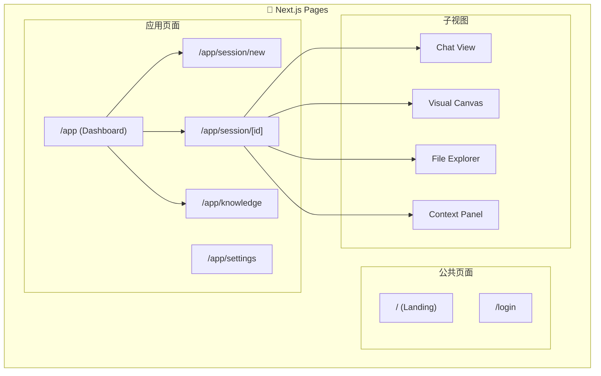
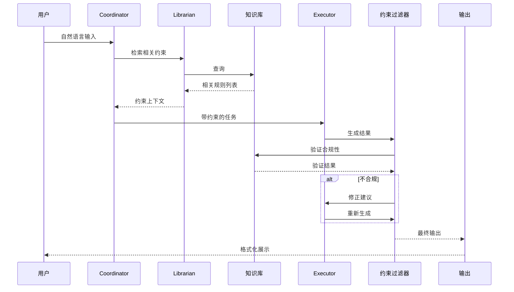

# Vibe Engineering Platform - 概念设计文档

这是一个雄心勃勃的项目！让我为你构建一套完整的设计文档体系。

---

## 📐 系统架构总览



---

## 1️⃣ 核心数据模型

<details>
<summary><strong>点击展开 - 数据模型定义</strong></summary>

### 1.1 Session (会话)

```json
// /data/sessions/{session_id}.json
{
  "id": "sess_abc123",
  "type": "vibe_coding" | "text_to_ppt" | "general",
  "created_at": "2024-01-15T10:30:00Z",
  "updated_at": "2024-01-15T14:22:00Z",
  
  "state": {
    "phase": "planning" | "executing" | "reviewing" | "completed",
    "current_step": 3,
    "total_steps": 7
  },
  
  "context": {
    "working_directory": "/workspace/project-x",
    "language": "zh-CN",
    "preferences": {
      "detail_level": "medium",
      "output_format": "markdown"
    }
  },
  
  "messages": [
    {
      "id": "msg_001",
      "role": "user" | "assistant" | "system" | "agent",
      "content": "...",
      "timestamp": "2024-01-15T10:30:00Z",
      "metadata": {
        "tokens_used": 1500,
        "model": "gpt-4",
        "attachments": []
      }
    }
  ],
  
  "artifacts": [
    {
      "id": "art_001",
      "type": "file" | "code" | "document",
      "path": "/workspace/project-x/src/main.py",
      "summary": "核心业务逻辑文件",
      "changes": [
        {
          "type": "create" | "modify" | "delete",
          "description": "添加用户认证模块",
          "diff": "@@ ... @@"
        }
      ]
    }
  ],
  
  "constraints": {
    "active": true,
    "rules": ["rule_001", "rule_002"],
    "knowledge_refs": ["kb_003", "kb_007"]
  }
}
```

### 1.2 Knowledge Base Entry (知识库条目)

```json
// /data/knowledge/{kb_id}.json
{
  "id": "kb_001",
  "type": "rule" | "pattern" | "preference" | "context",
  
  "content": {
    "title": "Python FastAPI 项目结构规范",
    "body": "FastAPI项目应采用以下目录结构...",
    "examples": [
      {
        "description": "正确的项目结构",
        "code": "..."
      }
    ]
  },
  
  "metadata": {
    "tags": ["backend", "fastapi", "structure"],
    "source": "user_defined" | "learned" | "default",
    "confidence": 0.95,
    "usage_count": 42
  },
  
  "triggers": {
    "keywords": ["fastapi", "api", "endpoint"],
    "session_types": ["vibe_coding"],
    "context_patterns": ["创建新项目", "添加路由"]
  },
  
  "created_at": "2024-01-10T08:00:00Z",
  "updated_at": "2024-01-15T12:00:00Z"
}
```

### 1.3 Agent Instance (Agent实例)

```json
// /data/sessions/{session_id}/agents/{agent_id}.json
{
  "id": "agent_coord_001",
  "type": "coordinator" | "context_parser" | "librarian" | "executor" | "coder",
  
  "config": {
    "model": "gpt-4-turbo",
    "temperature": 0.7,
    "max_tokens": 4000,
    "system_prompt": "你是一个Vibe Engineering平台的协调Agent..."
  },
  
  "memory": {
    "short_term": [...],
    "long_term_refs": ["kb_001", "kb_003"]
  },
  
  "tools": ["file_read", "file_write", "bash", "web_search"],
  
  "state": {
    "status": "idle" | "thinking" | "executing" | "waiting",
    "current_task": "解析用户指令",
    "progress": 0.65
  }
}
```

</details>

---

## 2️⃣ SubAgent 系统设计



### 2.1 各SubAgent职责

| Agent | 职责 | 输入 | 输出 |
|-------|------|------|------|
| **Coordinator** | 任务分解与调度 | 用户原始指令 | 分解后的子任务列表 |
| **Context Parser** | 解析会话上下文 | 原始上下文 + 指令 | 结构化报告 |
| **Librarian** | 知识检索与管理 | 查询意图 | 相关知识条目 |
| **Executor** | 执行具体操作 | 任务描述 + 约束 | 执行结果 |
| **Coder** | 代码生成与修改 | 代码需求 + 规范 | 代码Diff |

### 2.2 Vibal Sense 指令解析

```
格式: .<action> [target] [--flag[~level]]

示例:
  .list changes --detailed[~4 sentences each]
  .explain --scope[all changes] --format[markdown]
  .summarize --length[brief] --focus[logic]
  .diff --type[unified] --context[3 lines]
```

---

## 3️⃣ API 接口设计

<details>
<summary><strong>点击展开 - FastAPI Endpoints</strong></summary>

```python
# /backend/app/api/v1/
from fastapi import APIRouter, HTTPException
from pydantic import BaseModel
from typing import Optional
from datetime import datetime

router = APIRouter(prefix="/api/v1")

# ========== Session APIs ==========

class CreateSessionRequest(BaseModel):
    type: str  # "vibe_coding" | "text_to_ppt" | "general"
    context: Optional[dict] = {}

class MessageRequest(BaseModel):
    content: str
    attachments: Optional[list] = []
    command: Optional[str] = None  # vibal sense commands

@router.post("/sessions")
async def create_session(req: CreateSessionRequest):
    """创建新会话"""
    session = await session_manager.create(
        type_=req.type,
        context=req.context
    )
    return {"session_id": session.id, "session": session}

@router.get("/sessions/{session_id}")
async def get_session(session_id: str):
    """获取会话详情"""
    session = await session_manager.get(session_id)
    if not session:
        raise HTTPException(404, "Session not found")
    return session

@router.post("/sessions/{session_id}/messages")
async def send_message(session_id: str, req: MessageRequest):
    """发送消息/命令"""
    response = await agent_orch.process(
        session_id=session_id,
        content=req.content,
        command=req.command
    )
    return response

# ========== Knowledge APIs ==========

@router.get("/knowledge")
async def search_knowledge(
    query: str,
    session_type: Optional[str] = None,
    limit: int = 10
):
    """检索知识库"""
    results = await librarian.search(
        query=query,
        filters={"session_type": session_type},
        limit=limit
    )
    return {"results": results}

@router.post("/knowledge")
async def add_knowledge(entry: dict):
    """添加知识条目"""
    kb_id = await knowledge_base.add(entry)
    return {"id": kb_id}

# ========== Artifact APIs ==========

@router.get("/sessions/{session_id}/artifacts")
async def list_artifacts(session_id: str):
    """列出会话产生的所有产物"""
    artifacts = await session_manager.get_artifacts(session_id)
    return {"artifacts": artifacts}

@router.get("/sessions/{session_id}/artifacts/{artifact_id}")
async def get_artifact(session_id: str, artifact_id: str):
    """获取产物详情"""
    artifact = await artifact_store.get(artifact_id)
    return artifact

# ========== MCP Tool APIs ==========

@router.get("/tools")
async def list_tools():
    """列出所有可用工具"""
    return {"tools": await mcp_server.list_tools()}

@router.post("/tools/{tool_name}/execute")
async def execute_tool(tool_name: str, params: dict):
    """执行MCP工具"""
    result = await mcp_server.execute(tool_name, params)
    return result
```

</details>

---

## 4️⃣ 前端页面结构



### 页面组件层级

```
/app/session/[id]
├── SessionLayout
│   ├── Header (会话标题、操作按钮)
│   ├── MainContent
│   │   ├── ChatPanel (主对话区)
│   │   │   ├── MessageList
│   │   │   │   └── MessageItem (不同类型: user/assistant/artifact)
│   │   │   ├── CommandBar (vibal sense 输入)
│   │   │   └── InputArea
│   │   │
│   │   ├── SidePanel (可折叠)
│   │   │   ├── ContextView (上下文解析)
│   │   │   ├── FileExplorer
│   │   │   └── KnowledgeRef
│   │   │
│   │   └── CanvasView (可视化编辑)
│   │       ├── VisualEditor
│   │       └── PreviewPane
│   │
│   └── StatusBar (Agent状态、Token统计)
```

---

## 5️⃣ 约束管线机制



### 约束类型

| 类型 | 说明 | 示例 |
|------|------|------|
| `rule` | 硬性规则 | "不允许删除生产环境文件" |
| `pattern` | 推荐模式 | "API路由应使用RESTful风格" |
| `preference` | 用户偏好 | "代码注释使用中文" |
| `context` | 上下文约束 | "当前项目是FastAPI单体应用" |

---

## 6️⃣ 目录结构

```
vibe-engineering-platform/
├── frontend/                     # Next.js + React
│   ├── app/
│   │   ├── page.tsx             # Landing page
│   │   ├── login/
│   │   ├── app/
│   │   │   ├── layout.tsx       # App shell
│   │   │   ├── page.tsx         # Dashboard
│   │   │   ├── session/
│   │   │   │   ├── new/
│   │   │   │   └── [id]/
│   │   │   └── knowledge/
│   │   └── api/                 # API routes (optional BFF)
│   ├── components/
│   │   ├── ui/                  # Base components
│   │   ├── chat/                # Chat components
│   │   ├── canvas/              # Visual editor
│   │   └── layout/              # Layout components
│   ├── lib/
│   │   ├── api.ts               # API client
│   │   ├── store.ts             # State management
│   │   └── utils.ts
│   └── tailwind.config.js
│
├── backend/                     # Python + FastAPI
│   ├── app/
│   │   ├── main.py              # Entry point
│   │   ├── config.py            # Configuration
│   │   ├── api/
│   │   │   └── v1/
│   │   │       ├── sessions.py
│   │   │       ├── knowledge.py
│   │   │       ├── artifacts.py
│   │   │       └── tools.py
│   │   ├── agents/
│   │   │   ├── base.py          # Base agent class
│   │   │   ├── coordinator.py
│   │   │   ├── context_parser.py
│   │   │   ├── librarian.py
│   │   │   ├── executor.py
│   │   │   └── coder.py
│   │   ├── services/
│   │   │   ├── session_manager.py
│   │   │   ├── knowledge_base.py
│   │   │   ├── constraint_pipeline.py
│   │   │   └── mcp_server.py
│   │   ├── models/
│   │   │   ├── session.py
│   │   │   ├── message.py
│   │   │   ├── knowledge.py
│   │   │   └── artifact.py
│   │   └── utils/
│   ├── data/                    # Local JSON storage
│   │   ├── sessions/
│   │   ├── knowledge/
│   │   ├── config/
│   │   └── cache/
│   ├── requirements.txt
│   └── pyproject.toml
│
├── shared/                      # Shared types/schemas
│   ├── types/
│   └── schemas/
│
└── README.md
```

---

## 7️⃣ 开发路线图

### Phase 1: MVP - 核心循环 ✅

```
目标: 验证基本Agent协作流程
```

| 任务 | 优先级 | 预计工时 |
|------|--------|----------|
| 项目脚手架 (Next.js + FastAPI) | P0 | 2h |
| 基础数据模型 + JSON存储 | P0 | 3h |
| Session CRUD API | P0 | 2h |
| 前端基础UI框架 | P0 | 3h |
| 简单的Coordinator Agent | P0 | 4h |
| 基础对话功能 | P0 | 4h |
| **小计** | | **~18h** |

### Phase 2: 上下文管理 🔧

```
目标: 实现上下文解析和知识检索
```

| 任务 | 优先级 | 预计工时 |
|------|--------|----------|
| Context Parser SubAgent | P1 | 6h |
| Librarian SubAgent | P1 | 6h |
| 知识库CRUD + 检索 | P1 | 5h |
| 前端上下文面板 | P1 | 4h |
| Vibal Sense指令解析 | P1 | 4h |
| **小计** | | **~25h** |

### Phase 3: 约束管线 ⚙️

```
目标: 实现完整的约束验证流程
```

| 任务 | 优先级 | 预计工时 |
|------|--------|----------|
| 约束Pipeline架构 | P1 | 6h |
| 规则引擎实现 | P1 | 8h |
| 产物Diff追踪 | P2 | 6h |
| 结果验证反馈 | P2 | 4h |
| **小计** | | **~24h** |

### Phase 4: MCP集成 🔌

```
目标: 集成外部工具调用能力
```

| 任务 | 优先级 | 预计工时 |
|------|--------|----------|
| MCP Server实现 | P2 | 8h |
| 常用Tool适配器 | P2 | 6h |
| 前端工具面板 | P2 | 4h |
| **小计** | | **~18h** |

### Phase 5: 高级功能 🚀

```
目标: 提升用户体验和Agent能力
```

| 任务 | 优先级 | 预计工时 |
|------|--------|----------|
| Visual Canvas | P2 | 12h |
| 多模态支持 | P3 | - |
| 协作功能 | P3 | - |

---

## 📝 后续建议

1. **先跑通核心循环**: Phase 1完成后，用一个简单场景测试整个流程
2. **数据模型保持灵活**: JSON存储便于迭代修改schema
3. **Agent可插拔设计**: 预留Agent注册机制，方便后续扩展
4. **渐进式复杂度**: 约束管线Phase 3可以先简化，等核心功能稳定再加

---

需要我进一步展开哪个部分的详细设计？比如：
- 具体的Context Parser prompt工程
- 数据模型的完整JSON Schema
- 前端组件的代码结构
- 某个具体API的请求/响应示例